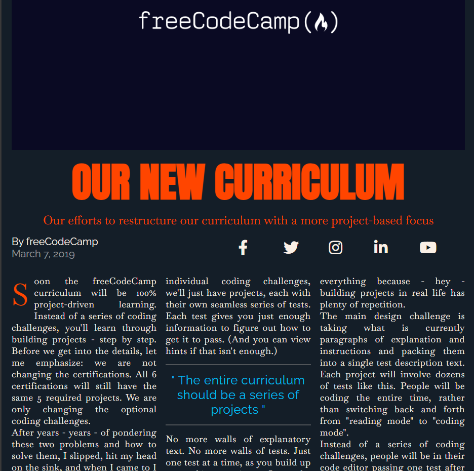

CSS - 1017 out of 1155 Steps Completed

Putting the practice into Grid layout today and making it responsive with the magazine/newspaper workshop and the magazine layout lab creation today.

#### ***What have I completed today*** :white_check_mark:

- FCC CSS Grid Magazine Workshop
- FCC CSS Grid Magazine Layout Lab
- FCC Debugging CSS
- FCC Grid Quiz

#### ***What is next on the list*** :pencil2:

- FCC CSS Animations
    - Lecture: Animations & Accessibility
    - Workshop: Build an Animated Ferris Wheel
    - Lab: Build a Moon Orbit
    - Workshop: Build a Flappy Penguin
    - CSS Animations Quiz

#### ***What have I been reading?*** :books:

- [Font Awesome Docs](https://docs.fontawesome.com/)